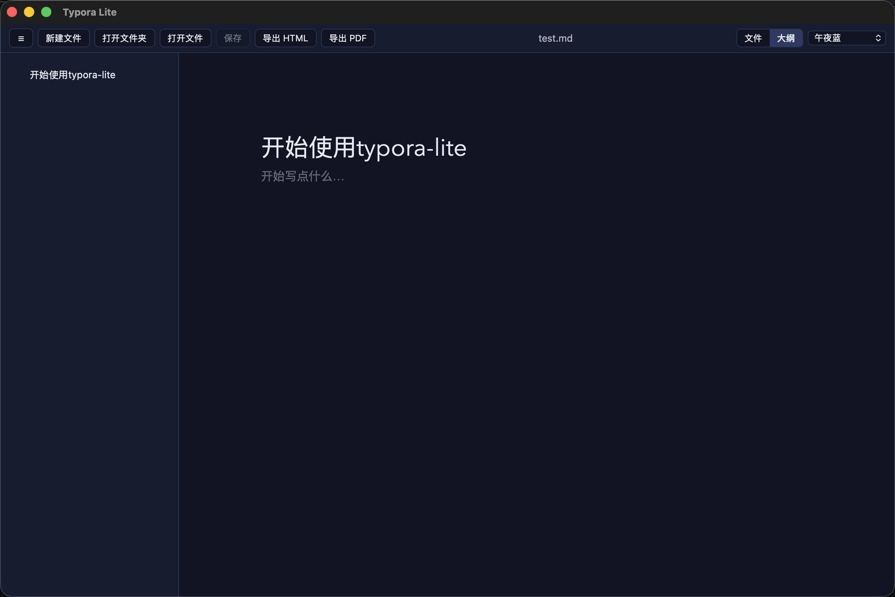
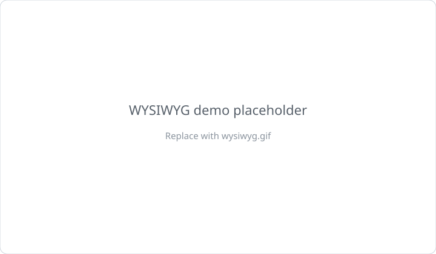
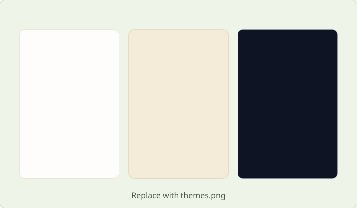
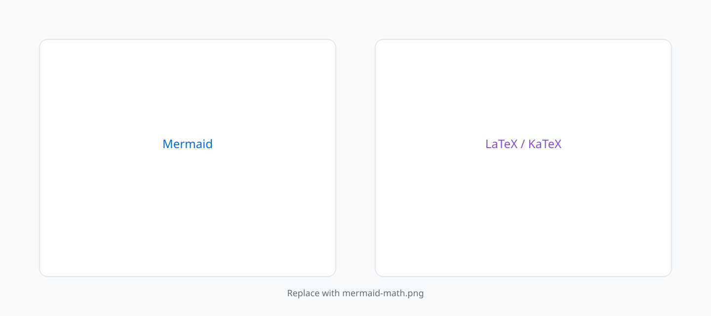

# Typora Lite

轻量、快速的所见即所得 Markdown 编辑器。界面与写作体验贴近 Typora，基于 **Tauri 2** 打造——安装包更小、启动更快、内存占用更低，支持 **macOS** 与 **Windows**。

> Typora 风格 WYSIWYG，开源免费、本地优先；用系统 WebView 而不是整包 Chromium。

## 下载安装

请前往 GitHub **[Releases](https://github.com/JustinGastby/typora-lite/releases)** 下载对应平台安装包，无需编译源码。

| 平台 | 推荐下载 |
|------|----------|
| macOS Apple Silicon（M 系列） | `Typora.Lite_*_aarch64.dmg` |
| macOS Intel | `Typora.Lite_*_x64.dmg` |
| Windows | `Typora.Lite_*_x64-setup.exe` 或 `.msi` |

当前未配置付费代码签名，首次打开若被系统拦截：

- **macOS**：右键应用 →「打开」
- **Windows**：SmartScreen →「更多信息」→「仍要运行」

## 为什么选 Typora Lite

- **真·轻量桌面应用**：Tauri + 系统 WebView，比常见 Electron 编辑器更省资源
- **所见即所得**：输入即渲染，少切换预览窗格
- **开箱即用**：Releases 一键安装
- **本地优先**：文档与图片在你自己的文件夹里，无强制账号与云同步

## 界面预览

| 所见即所得写作 | 多主题 |
|----------------|--------|
|  |  |
| *可替换为 `wysiwyg.gif`* | *可替换为 `themes.png`* |

<em>Mermaid / LaTeX — 可替换为 <code>mermaid-math.png</code></em>

## 功能特点

- 所见即所得实时编辑（表格、任务列表、代码高亮）
- 文件树侧边栏：打开文件夹后快速切换；支持新建未命名文件
- 大纲面板：标题生成可点击目录
- LaTeX 数学公式（`$...$` / `$$...$$`）
- Mermaid 图表：代码块自动渲染，可切回源码
- 图片粘贴 / 拖拽保存到文档旁 `assets/`
- 本地图片（含 `file://`、HTML ``）正确显示；四角拖拽缩放
- 拖拽 `.md` / 文件夹到窗口即可打开
- 自动保存与未保存提示
- 多套主题：暖白 / 深色 / GitHub / 羊皮纸 / 森绿 / 午夜蓝
- 导出 HTML，或经系统打印导出 PDF
- 原生菜单栏与常用快捷键

## 技术概览

| 方面 | 方案 |
|------|------|
| 桌面壳 | Tauri 2（Rust） |
| 界面 | React 19 + TypeScript + Vite |
| 编辑内核 | Milkdown + Crepe（ProseMirror） |
| 公式 / 图表 | KaTeX、Mermaid |
| 本地能力 | 文件系统、对话框、设置持久化（Tauri 插件） |

## 适用场景

日常笔记、技术文档、带公式/图表的草稿、需要本地文件夹管理的 Markdown 写作。适合想要 Typora 式体验、又不想承担 Electron 体积与资源开销的用户。

## License

[MIT](./LICENSE) © JustinGastby
